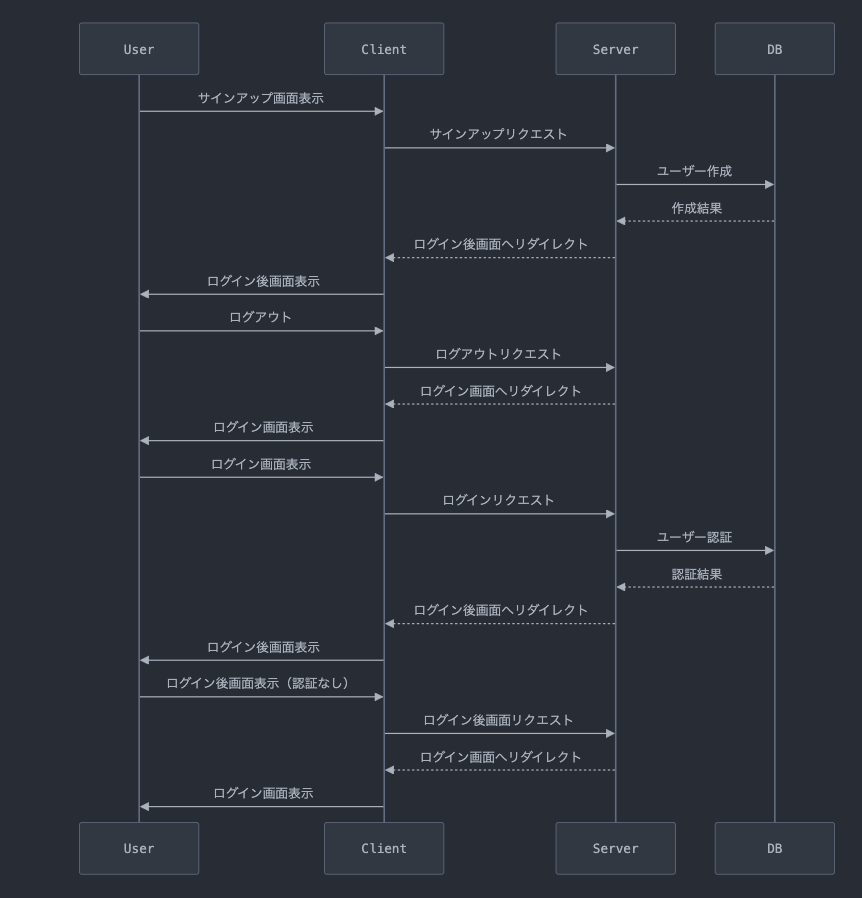

# NestAuth.jsとPrismaのTypeSQLを使ってログイン機能を実装してみた

## はじめに

NestAuth.jsとPrismaのTypeSQLを使ってログイン機能を実装してみたので、その方法を紹介します。

## 環境

Node.js 22.12.0
Next.js 15.1.6
React 19.0.0
TypeScript 5

## シーケンス図
### サインアップフロー
ユーザーがサインアップを行い、アカウントを作成
作成後、自動的にログイン状態となる

### ログアウトフロー
ユーザーがログアウトを実行
ログイン画面へ遷移

### ログインフロー
ユーザーが認証情報を入力してログイン
認証成功後、ログイン後画面へ遷移

### 未認証アクセスフロー
認証が必要な画面へ未認証でアクセス
ログイン画面へリダイレクト
